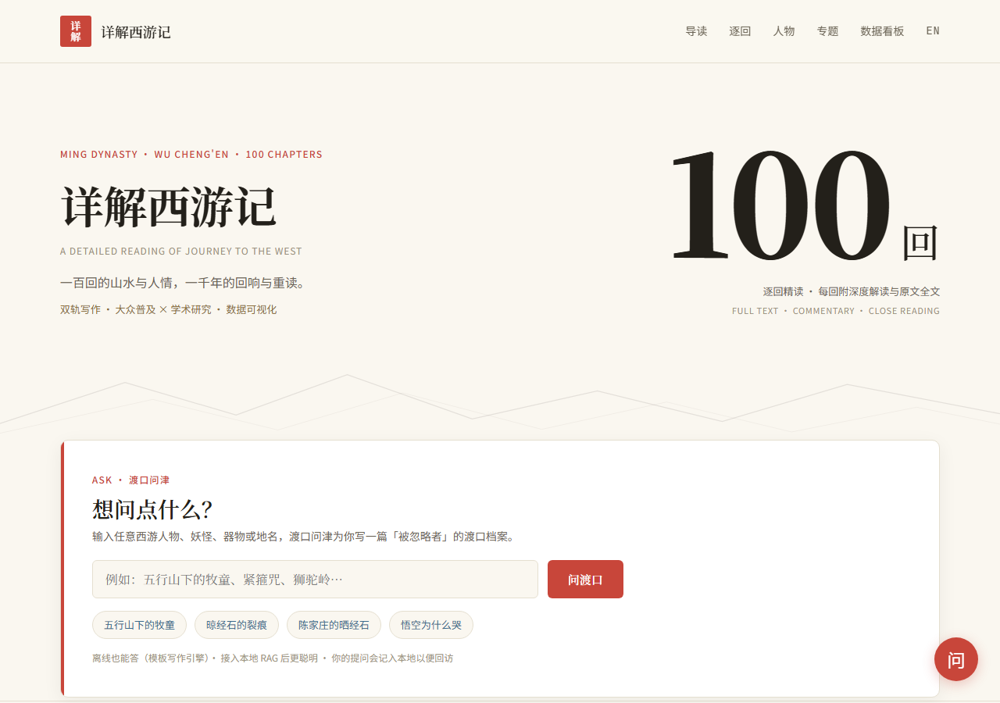

# 📖 详解西游记

> 一源多形 · 数字人文可视化解读《西游记》100 回 —— 既写给愿意深读原著的读者，也写给只想取一瓢饮的过路人。
>
> **当前版本 v2.3.82（2026-08-18）**： W464 Phase 3 观测基线确立·A1-A6 共 611 篇 + 86 可视化页（A4 209 篇 已含）·详细变更见 [CHANGELOG.md](CHANGELOG.md)。
>
> **版本号说明**：本项目的 `vX.Y.Z` 是**内容发布批次编号，不适用 SemVer 兼容性承诺**——站点无 API、无下游依赖方，每个发布批次（W###）递增 patch 位。MAJOR/MINOR 位对应内容阶段（v2.x = 内容体系成熟期）。判断"这个版本改了什么"请看 [CHANGELOG.md](CHANGELOG.md)，不要从版本号推断兼容性。
>
> **维护契约**：版本行由 `bump_version.py` 维护；项目变更一律进 CHANGELOG，本文件**禁止追加里程碑 / 批次速记**；结构性编辑（分区 / 目录树 / 计数声明）须与 STRUCTURE / 项目说明 / `verify_delivery.py` 口径一致。

[](https://1273984347.github.io/xiyouji/)
[](LICENSE)
[](.github/workflows/pages.yml)

---

# 📖 普通读者专区

## 🚀 在线体验（推荐所有读者）

**无需安装，点开即读** 👉 [**https://1273984347.github.io/xiyouji/**](https://1273984347.github.io/xiyouji/)



*如果图片加载慢，请直接点击上方链接打开站点。*

**本地浏览**：克隆仓库后双击 `site/index.html`（纯静态站点，支持 `file://` 协议直接打开，无需安装任何软件）。

## 🎁 你将会看到什么？

- 📖 **全书逐回解读**：100 回逐回讲解 + 深度解读 + 原文全文 → [docs/01-全书逐回解读/](docs/01-全书逐回解读/)
- 🕸️ **人物深度分析**：孙悟空/唐僧/八戒/沙僧/观音/妖怪谱系/女性角色 → [docs/02-人物深度分析/](docs/02-人物深度分析/)
- 🗺️ **主题与情节专题**：大闹天宫/八十一难/真假美猴王/取经团队动力学 → [docs/03-主题与情节专题/](docs/03-主题与情节专题/)
- 📚 **文化与历史背景**：成书背景/佛道思想/明代社会隐喻/版本演变 → [docs/04-文化与历史背景/](docs/04-文化与历史背景/)
- 📜 **诗词歌赋**：原著诗词赏析/回目对联/主题诗词创作 → [docs/05-诗词歌赋/](docs/05-诗词歌赋/)
- 💭 **个人随笔**：现代视角解读/职场映射/时代变迁中的西游（44 篇）→ [docs/06-个人随笔/](docs/06-个人随笔/)
- 📊 **数据可视化**：86 个 D3.js 可视化/交互页（弹幕博物馆/情感热力图/AI 名人对话/原著检索等）→ [site/data/](site/data/)
- 🔍 **术语速查**："心猿""木母""黄婆"等内丹术语 → [术语表](docs/00-导读/术语表.md)

> **双轨写作**：每篇文档开头以 `>轨标：大众普及 / 学术研究 / 教学讲解 / 个人创作 / 跨界趣谈` 标明轨别，读者可按需选择（轨标准入见 [文档规范](docs/00-导读/文档规范.md)）。
>
> **统计口径**：文中所有数字（篇数 / 页面 / 维度 / 引用）的统计算法见 [统计口径说明](docs/00-导读/统计口径说明.md)。

## 🗺️ 项目定位

本项目以「**一源多形**」的方式组织《西游记》的解读工作：

- **文档（Docs）**：以 Markdown 写就的逐回解读、人物分析、主题专题、文化背景、诗词赏析、个人随笔
- **站点（Site）**：可浏览的 HTML 页面，含导航、时间线、人物关系图等
- **数据可视化**：所有数据维度均配套 D3.js 可视化页面（古典宣纸风配色 #faf7f2/#c8463a/#3a6b8c），含折线图、柱状图、桑基图、雷达图、散点图、饼图、热力图、矩阵图等，覆盖 34 类主题（A-AH）+ 批评史双联 + 弹幕博物馆 + 新功能三页面

**数据维度全景（133 维）**：

| 阶段 | 类别 | 维度数 | 关键维度示例 |
|---|---|---|---|
| Phase 1-4 + v0.6 补全 | A-L | 42 | 章节统计·词频·八十一难·取经路线·势力分布·心猿曲线·风险评估·MBTI·生死簿·组织对比 |
| Phase 5 M-U | M-U | 28 | 洞府房产·法力能量守恒·悟空时尚曲线·批点弹幕·反派矩阵·翻译偏差 |
| Phase 6 V-AH | V-AH | 43 | 职场黑话·MBTI·卡牌战力·IPO 招股书·因果多米诺·叙事卡牌·气味地图·可得性启发·入侵物种·量刑经济学·法宝材质·咒语结构 |
| Phase 7 Q+ 批评史双联 | Q+ | 8 | 9 批评家档案·解读流派河流·三教争辩·作者候选人·内丹密码·装置元数据·李贽弹幕·莫比乌斯环 |
| Phase 7 Q++ 弹幕博物馆 | Q++ | 8+3 | 4 段名人档案（明清/民国/现代/当代）·4 年龄段分层·世纪对话·名人看当下·国际名人弹幕组·全球改编作品 |
| Phase 7 Q+++ 新功能三页面 | Q+++ | 1 | 情感热力图（8 批评家 × 20 难）·交互式时间线（成书史/版本演变/文化影响）·AI 名人对话 |

> 口径：133 维为维度清单合计（含趣味实验维度），统计算法见 [统计口径说明](docs/00-导读/统计口径说明.md)。

## 🎯 目标读者

- **大众读者**：从本文档「在线体验」直达，或 `docs/00-导读/` 与 `site/` 之间穿梭
- **逐回解读读者**：`docs/01-全书逐回解读/` 100 回全覆盖（开篇·学艺·龙宫借宝·闹天宫·取经启动·组建·团队集结·决裂·中段斗法·整合·火焰山·狮驼岭·后期识魔·终回 + 批 1-13 补全）
- **学术研究者**：重点看 `docs/02-04/` 与 `references/`；如对研究有帮助，请按 [CITATION.cff](CITATION.cff) 引用
- **批评史研究者**：[criticism-history.html](site/data/criticism-history.html) 学术长卷（500 年解读流变·9 批评家·三教争辩·内丹密码）+ [concept-device.html](site/data/concept-device.html) 观念装置（三棱镜/收音机/莫比乌斯环/密码卡/弹幕重映/侦探墙）
- **教学者**：参考 `docs/01-全书逐回解读/` 与 `timeline/`
- **同好创作者**：在 `docs/05-诗词歌赋/` 与 `docs/06-个人随笔/` 自由发挥
- **数据可视化爱好者**：`site/data/` 86 个可视化页（含 V3 标签云全站导航 W313）
- **跨学科研究者**：重点看 V-AH 13 类（认知心理/生态学/法理经济/物质考古/语言学等）
- **全年龄段读者**：Q++ 名人弹幕博物馆（幼儿表情包墙·初中观点 PK·高中政治隐喻解码·大学学术谱系·打工人看金圣叹反内卷）

---

# 🔧 开发者 / 维护者专区

> 以下为工程维护内容，普通读者可完全忽略。想直接读内容请回到 [普通读者专区](#-普通读者专区)。

<details>
<summary>点击展开：工程与维护文档</summary>

## 技术栈

- **可视化**：D3.js（数据图表）、Three.js（3D 页面）
- **文本分析**：Python（词频/共现/情感/术语 NLP）
- **前端**：原生 HTML/CSS/JS（纯静态·file:// 可直接打开）
- **Web Agent**：CodeBuddy Agent SDK（`xiyouji-agent-web/`）
- **CI/CD**：GitHub Actions（pytest/Playwright/Lighthouse/pip-audit/npm-audit）

## 目录结构

```
xiyouji/
├── docs/                  # Markdown 文档主体（18 个板块）
│   ├── 00-导读/           # 项目说明、阅读指南、版本概览、术语表
│   ├── 01-全书逐回解读/   # 100 回逐回解读
│   ├── 02-人物深度分析/   # 主要人物谱系分析
│   ├── 03-主题与情节专题/ # 大闹天宫、九九八十一难等专题
│   ├── 04-文化与历史背景/ # 成书背景、佛道思想、明代隐喻
│   ├── 05-诗词歌赋/       # 原著诗词赏析与个人创作
│   ├── 06-个人随笔/       # 现代视角解读、个人札记
│   ├── 07-学以致用/       # 学习路径、决策模型、领导力、危机应对
│   ├── 08-提升认知/       # 角色思维模型、反事实训练、元认知地图
│   ├── 09-精神塑造/       # 八十一难人生隐喻、自我整合、价值坐标系
│   ├── 10-方法论沉淀/     # DRL 真循环 / 三 skill 闭环 / E1 铁律 / 双索引改造
│   ├── S2-外部分享/       # 内容分发·精选发布版（S2 阶段）
│   ├── S2-学术投稿/       # 学术论文投稿（S2 阶段）
│   ├── S3-方法论外部分享/ # 方法论外部分享（S3 阶段）
│   ├── S4-学术投稿/       # 学术投稿（S4 阶段）
│   ├── superpowers/       # 开发过程 spec/plan 档案
│   ├── _dev/              # 开发内部文档（不对外）
│   └── _templates/        # 内容模板（与线上结构脱节·勿直接套用）
├── dataset/               # 结构化数据 JSON（可视化/API 数据源）
├── source/                # 原著与引用（原文/分回 + 学术论文索引/网络解读精选）
├── site/                  # 可浏览的 HTML 站点（D3.js 驱动·index/dashboard/chapters/characters/themes/data/static）
├── scripts/               # Python 文本分析脚本（按 A-AH 34 类组织 + utils + output）
├── timeline/              # 时间线专题（取经路线、大事年表、人物时间线）
├── assets/                # 字体源、图片等静态资源
├── references/            # 参考文献
├── tools/                 # 辅助工具（章节切分等）
├── hyperframes/           # HTML 视频实验产物（W200 遗留·待清理决策）
├── mcp-server/            # MCP 服务（xiyouji_drl_spotcheck 等工具）
├── tests/                 # pytest 测试 + Playwright E2E
├── xiyouji-agent-web/     # Web Agent「西游记·渡口问津」（CodeBuddy Agent SDK）
├── skills/                # 项目级 playbook skill（version-bump/en-translation/s4-submission/character-content/characters-knowledge/5 单人角色）
├── .github/workflows/     # CI/Security/Deploy Pages/Lighthouse/截图审查
├── README.md              # 本文件（用户手册 + 开发者分区）
├── STRUCTURE.md           # 目录结构详细说明
├── CHANGELOG.md           # 更新日志（W001-W464）
└── LICENSE                # 双协议授权声明
```

详细结构说明见 [STRUCTURE.md](STRUCTURE.md)。

## 运行分析脚本

```bash
cd scripts
pip install -r requirements.txt
python word_frequency.py --input ../source/原文/西游记-全文.txt --output output/data/word_freq.json
```

## 测试（pytest + Playwright E2E）

```bash
# pytest 全量（含 MCP 工具测试）
pytest tests -q

# 三层 E2E：冒烟 / 深度交互 / 视觉回归
cd scripts
npm install
npm run test:e2e
```

## 截图审查（发布前自动布局检查）

```bash
cd scripts
npm install          # playwright + chromium
npm run screenshots  # 批量截图 + 布局断言 + 自动切片
python detect_unwrapped_tables.py   # 静态表格扫描（双轨之二）
```

详细收敛记录见 [scripts/output/drl-screenshot-review.md](scripts/output/drl-screenshot-review.md)。

## 文档索引（双索引可追溯）

- **正向索引（时间线）**：[CHANGELOG.md](CHANGELOG.md) — 按版本记录变更，每版本段标注唯一 W### ID（W001-W464）+ 四件套（来源/文件/验证/状态）。v0.1-v2.0.60 历史归档至 [CHANGELOG-ARCHIVE.md](CHANGELOG-ARCHIVE.md)
- **反向索引（文件）**：[scripts/output/file-index.md](scripts/output/file-index.md) — 给定文件查改过几次、对应哪个 W 条目

**W### 编号规则**：W001-W099 对应 v0.1-v2.0.72；W100+ 对应 v2.1.0+；新增 W 条目时同步更新两个索引。详细映射见 [CHANGELOG.md](CHANGELOG.md)。

**使用场景**：
1. 给定时间点查改了什么 → 读 CHANGELOG 正向时间线
2. 给定文件查改过几次 → 查 file-index 反向索引
3. 跨文件交叉追溯同一 W 条目的完整影响面 → 两个索引配合使用

## 文档维护规范

- 更新项目文档前请先阅读 [文档规范](docs/00-导读/文档规范.md)（防膨胀·归档规则·Keep a Changelog/SemVer/Conventional Commits/Diátaxis）
- 跨 session 接续流程见 [交接文档.md](交接文档.md)

</details>

---

## 学术引用

如本项目对您的研究有帮助，请按 [CITATION.cff](CITATION.cff) 中的格式引用；学术参考文献见 [学术论文索引](source/引用与网络解读/学术论文索引.md)。

## 贡献方式

见 [CONTRIBUTING.md](CONTRIBUTING.md)。

## 授权

本项目采用**双协议**授权：

- **源代码与项目文档**（Python/JavaScript/HTML 脚本、配置文件、site/ 下 HTML/CSS/JS 的代码结构、GitHub Actions workflows、根级 README/STRUCTURE/CHANGELOG 等）：[MIT License](LICENSE)
- **文本内容**（docs/ 下 A1-A6 内容板块与 07-09、S1 方法论、S2/S3/S4 学术投稿候选与外部分享；site/ 页面内渲染的上述原创解读文本）：[CC BY-NC 4.0](LICENSE-CONTENT.md)（署名-非商业性使用）

《西游记》原著文本已进入公共领域；引用的外部网络解读版权归原作者，仅作索引与摘录，不纳入本项目协议。

## 💬 反馈与建议

如有问题、勘误或想法，欢迎提交 [Issue](https://github.com/1273984347/xiyouji/issues) 或在在线站点评论区留言。

---

> 项目目录创建于 2026-07-21，初版骨架。W334（v2.2.86）全站设计系统·详细变更见 [CHANGELOG.md](CHANGELOG.md)。
